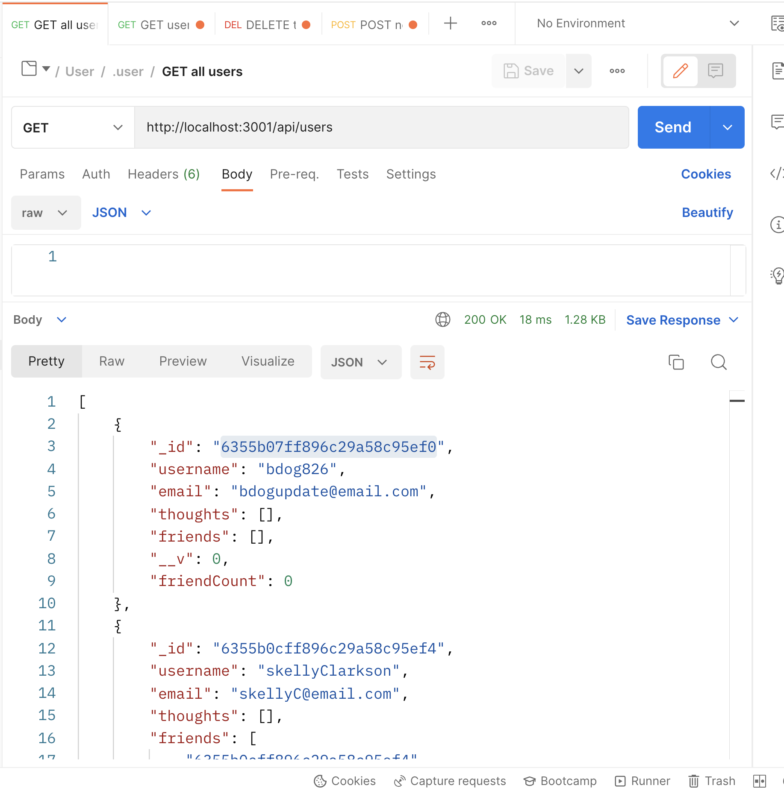
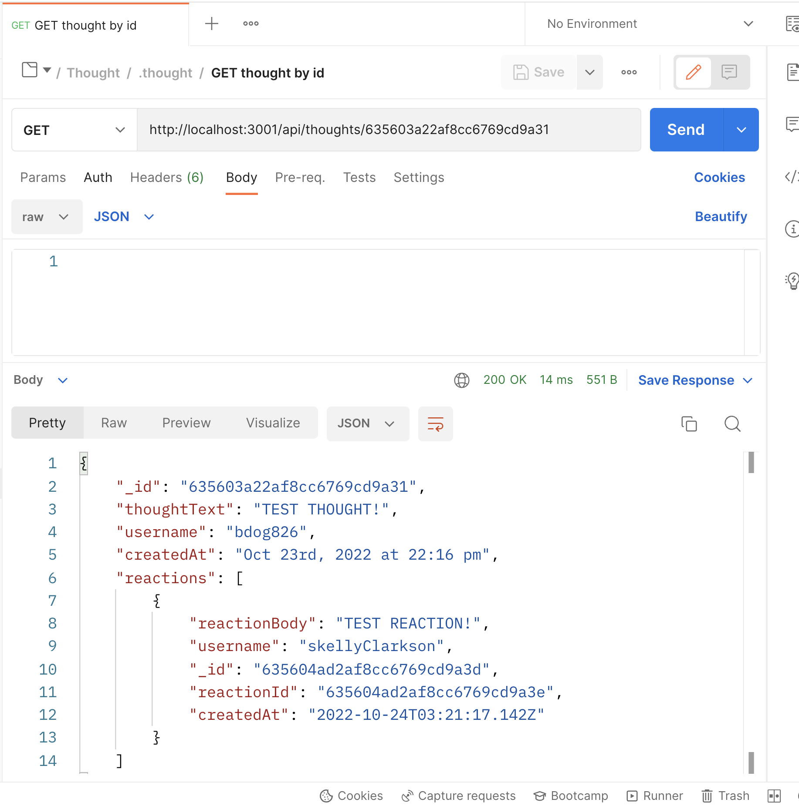

# social-media-api

## Introduction
This project is a result of our bootcamp's week 18 homework assignment. Students were expected to create a social media API using MongoDB, Mongoose, and Express.js. The project repository can be found [here](https://github.com/graycodesnu/social-media-api) and the demo video can be found [here](https://drive.google.com/file/d/1aCj5RaIgfWHvV62GrMeWq5BuCegjdEdC/view).

## Goals 
+ Use Mongoose and Express to connect to MongoDB and update using created routes
+ Create GET, POST, PUT, and DELETE routes for users and thoughts 
+ Create POST and DELETE routes for adding friends to users and adding reactions to thoughts
+ Test all routes in Postman using the database

## Results 
I really enjoyed this project and all of its complexities. One thing I was surprised by was how tricky it was to put the models together, since this was the first one we've built that has needed multiple schemas to interact with each other. Looking back on the early days of learning about APIs, I was blown away by the complexities. Now, it's exciting to think that I've built one very small one myself! 